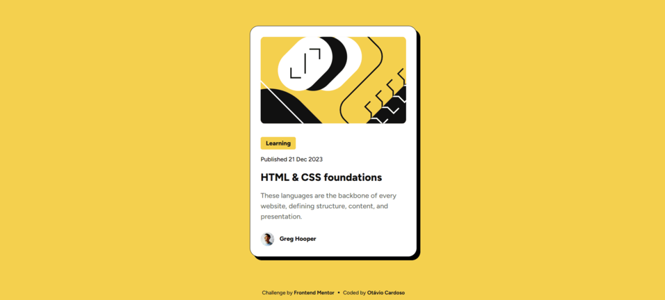
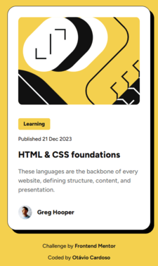

# Frontend Mentor - Blog preview card solution

This is a solution to the [Blog preview card challenge on Frontend Mentor](https://www.frontendmentor.io/challenges/blog-preview-card-ckPaj01IcS). Frontend Mentor challenges help you improve your coding skills by building realistic projects. 

## Table of contents

- [Overview](#overview)
  - [The challenge](#the-challenge)
  - [Screenshot](#screenshot)
  - [Links](#links)
- [My process](#my-process)
  - [Built with](#built-with)
  - [What I learned](#what-i-learned)
  - [Continued development](#continued-development)
- [Author](#author)

## Overview

### The challenge

Users should be able to:

- See hover and focus states for all interactive elements on the page

### Screenshot

### Links

- Solution URL: [solution](https://github.com/otaviozerotwo/Blog-preview-card)
- Live Site URL: [deploy](https://blog-preview-card-xi-gold.vercel.app/)

## My process

### Built with

- Semantic HTML5 markup
- Parcel (for build project and compile SASS)
- SASS
- Flexbox
- CSS Grid

### What I learned

I was able to consolidate the techniques and knowledge used in the previous challenge. This time I didn't use AI at any point.

### Continued development

I want to continue practicing layout design patterns so I can apply them with different technologies.

## Author

- Frontend Mentor - [@otaviozerotwo](https://www.frontendmentor.io/profile/otaviozerotwo)
- GitHub - [@otaviozerotwo](https://github.com/otaviozerotwo)